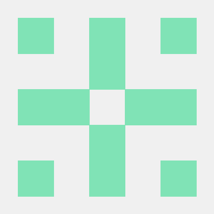

# Yakesho

  
  
  

# About me
Hello. My name is [@yakesho](https://github.com/yakesho/) (Not my real name). I've been developing for more than 4 years. Mostly in JavaScript. Right now, I'm learning **C++**, **C** and **Rust**. My dream is become a software engineer.

# Statistics
\

# Contributions

# Portfolio
My portfolio source code is available [here](./app). View it live [here](https://yakesho.github.io/yakesho/).

# License
This project and my [portfolio](./app) is licensed under the **MIT License**. Read the full license [here](./LICENSE).
